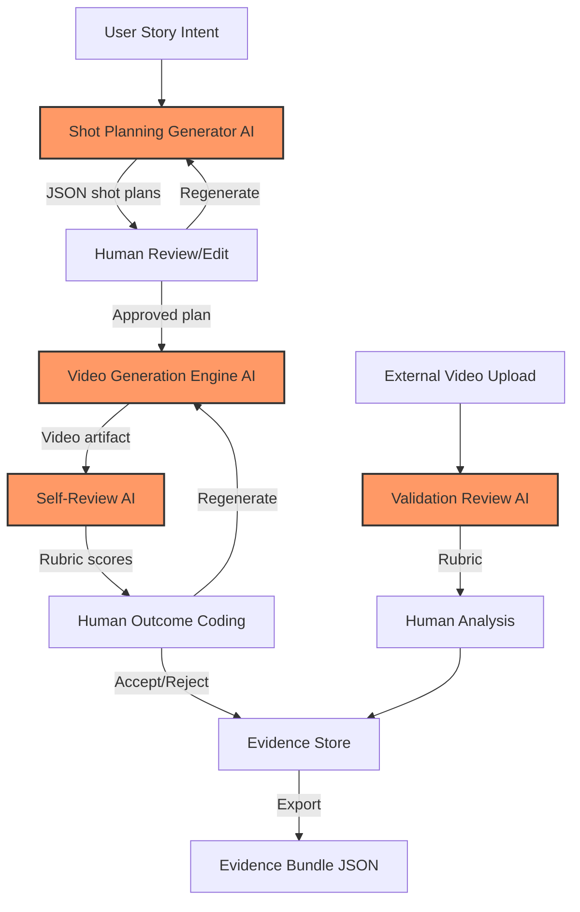
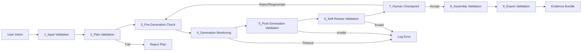

# Requirements, Design, and Trust Hypotheses
## AI-Assisted Short-Form Movie Production System
## Design v1.1 - Integrated Trust Analysis

**ITCS 6010/8010 – AI-Driven Trustworthy Software Development**  
**Authors:** Víctor H. Vargas, Theodore Japit, Dylan Christensen  
**Department of Software and Information Systems**  
**University of North Carolina at Charlotte**  
**Date:** February 6, 2026

---

## 1. Purpose and Framing

This document is the consolidated and authoritative specification for the AI-Assisted Movie Production System. It represents **Design v1.1**, a refined iteration that integrates:

- Refined functional and trust-related requirements
- **28 detailed trust hypotheses** with code anchors and gap analysis
- Provisional system design with explicit component descriptions
- **Pipeline stages** showing when and where trust evaluation occurs
- Comprehensive mapping between requirements, design components, pipeline stages, and candidate trust gates

The system is intentionally framed **not as a creative product optimized for output quality**, but as **a controlled environment for studying trust failures in AI-generated multimodal media**. Its primary goal is to expose uncertainty, surface failures, preserve evidence, and enable structured reasoning about where believable AI-generated artifacts diverge from declared intent, correctness, or trustworthiness.

**Key Design Principles:**
- AI components are treated as **fallible proposal generators**
- Humans retain **final authority** over all decisions
- **Evidence preservation** takes precedence over polish
- **Failure visibility** is more valuable than silent success
- **Pipeline-aware design** from the start, not bolted on later

All artifacts are provisional and expected to evolve through evidence gathered during implementation and DevOps-based evaluation.

**Document Lineage:**
- Builds on Design v1.0 (PDF, February 5, 2026)
- Integrates Trust Hypotheses Inventory (January 28, 2026)
- Incorporates Critical Assessment Findings (January 22, 2026)

---

## 2. System Overview

The system supports the creation, evaluation, regeneration, and assembly of short AI-generated cinematic shots (approximately 8 seconds each). In addition to producing media artifacts, the system is explicitly designed to support trust evaluation by:

- **Preserving intermediate artifacts and lineage** – Every generation attempt, prompt revision, and human decision is tracked
- **Surfacing failures and ambiguities** – Errors, timeouts, and validation failures are made visible rather than hidden
- **Preventing silent delegation of authority to AI** – Human checkpoints enforce TR4 (Human Authority)
- **Enabling structured outcome coding** – Failure taxonomy supports trust analysis

---

## 3. Functional Requirements (Brief)

### FR1: Story Intent and Constraint Capture
The system shall accept and record a user-provided story description, stylistic preferences, audio intent, content constraints, and optional reference images as the declared creative intent for a project.

### FR2: AI-Generated Shot Planning
The system shall use a generative language model to produce a structured plan for a sequence of shots. Each shot plan should include observable attributes such as action, camera behavior, mood or lighting, audio intent, dialogue (if any), and a prompt intended for video generation.

### FR3: Shot-Level Review, Editing, and Regeneration
The system shall allow users to review, edit, and regenerate individual shot plans. User edits shall override AI-generated values. Regeneration attempts shall not overwrite previous attempts.

### FR4: Video Generation per Shot
For each accepted shot plan, the system shall invoke a video generation model to produce a corresponding video artifact. The system may attempt to encourage continuity by providing reference images or prior-shot context when available.

### FR5: AI-Based Evaluation and Self-Review
The system shall generate evaluative feedback for generated shots and assembled sequences, including assessments of story coherence, cinematic realism, continuity, physical plausibility, and content appropriateness. This feedback is advisory only.

### FR6: Outcome Coding and Failure Classification
The system shall support structured outcome coding, including classification of failure types, failure visibility, trust calibration assessment, and human-authored observational notes.

### FR7: Attempt Lineage and Regeneration Tracking
The system shall track generation attempts for each shot, including prompt source and parent-child relationships between attempts.

### FR8: External Video Validation
The system shall support a validation mode in which externally provided video artifacts can be reviewed and evaluated independently of the generation workflow.

### FR9: Artifact Visibility and Evidence Export
The system shall make intermediate artifacts visible and support exporting them as a structured evidence bundle.

### FR10: Shot Assembly and Media Export
The system shall support assembling completed shots into a single playable and downloadable video artifact.

---

## 4. Trust-Related (Non-Functional) Requirements

### TR1: AI Fallibility
All AI-generated artifacts shall be treated as fallible and potentially incorrect.

### TR2: Continuity as an Attempted Property
The system shall attempt to preserve continuity, but continuity is not guaranteed. **Note:** Current implementation has gaps (see Section 6.2).

### TR3: Plausibility vs. Correctness Exposure
The system shall surface cases where outputs appear plausible while violating intent or consistency.

### TR4: Human Authority
Users retain final authority over acceptance and modification of all AI-generated artifacts.

### TR5: Transparency of AI Involvement
The system shall clearly indicate where AI influenced system behavior.

### TR6: Failure Surfacing
Detected errors and abnormal conditions should be surfaced rather than hidden.

### TR7: Best-Effort Reliability
Non-determinism, partial outputs, and stalled operations are expected and treated as evidence.

---

## 5. Assumptions and Known Ambiguities

### Assumptions
- Quality and realism are subjective
- AI-generated evaluations may be incorrect
- Continuity mechanisms may be ineffective
- Artifact persistence is best-effort (localStorage only)
- Structured outputs may violate schemas

### Known Ambiguities
- Acceptable continuity failure thresholds are undefined
- Reliability of AI self-evaluation is unknown
- The boundary between helpful feedback and false confidence is unclear
- Degree of intent distortion is unmeasured
- Trust calibration is purely subjective without guidance

---

## 6. Trust Hypotheses: Detailed Inventory

This section replaces the shallow 7-hypothesis set from v1.0 with **28 detailed trust hypotheses** derived directly from the implemented prototype. Each hypothesis includes:
- **Hypothesis ID** for cross-referencing
- **Statement** of what's being tested
- **Evidence in code** (file and line references)
- **Observed gaps** or implementation issues
- **Risk assessment**

### 6.1 Scenario-Level Hypotheses (Preset Scripts)

These live in `App.tsx` under the three built-in scripts that can be loaded during the planning phase.

| Hypothesis ID | Scenario | What is being stressed | Evidence in code | Notes / Risks |
|---------------|----------|------------------------|------------------|---------------|
| **H-S1** | "Continuity Drift" | Model will drift from wardrobe/props across shots unless seeded | `App.tsx` SCRIPTS entry enables `defaults: { useSeed: true }` | **CRITICAL GAP:** Backend never uses `useSeed`, so this hypothesis is currently untestable, causing false confidence. |
| **H-S2** | "Plausible Planning Errors" | Even with a calm scene, planning JSON may omit key controls | `App.tsx` SCRIPTS entry with defaults disabling seed/explanation | **GAP:** No validation on returned plan → silent schema drift undermines the hypothesis. |
| **H-S3** | "Misleading Explanations" | Asking for explanations may create hallucinated justifications | `App.tsx` SCRIPTS entry setting `requestExplanation: true` | **GAP:** Explanations are concatenated into prompts but never parsed, so the hypothesis cannot be inspected. |

### 6.2 Generation & Continuity Hypotheses

| Hypothesis ID | Statement | Supporting Implementation | Observed Gap |
|---------------|-----------|---------------------------|--------------|
| **H-G1** | Setting `useSeed: true` will improve continuity | `handleGenerateShot` always passes `{ useSeed: true }` (App.tsx) | **CRITICAL GAP:** `generateVideoAttempt` records `useSeed` in metadata but never forwards a seed or `previousVideoUrl` to Veo, so the hypothesis is unimplemented. |
| **H-G2** | Passing prior frames (`previousVideoUrl`) should stabilize regeneration | `generateVideoAttempt` signature includes `previousVideoUrl` (services/gemini.ts) | **CRITICAL GAP:** Parameter unused; any study of continuity is impossible until implemented. |
| **H-G3** | Requesting technical explanations improves future prompts | `requestExplanation: true` flag appended to prompt (App.tsx) | **GAP:** Explanations are never parsed/stored. Hypothesis cannot be evaluated, yet UI implies it is. |

**Impact on TR2:** The continuity requirement (TR2) claims the system "attempts to preserve continuity," but H-G1 and H-G2 reveal this is not implemented. Metadata creates **false evidence** that continuity mechanisms were used.

### 6.3 Measurement & Self-Review Hypotheses

| Hypothesis ID | Statement | Evidence in Code | Concerns |
|---------------|-----------|------------------|----------|
| **H-M1** | Gemini can score Narrative/Visual/Continuity/Physics dimensions reliably | `runAISelfReview` prompt + `SelfReviewRubric` schema (`services/gemini.ts`, `types.ts`) | **CRITICAL GAP:** JSON parse is unchecked; invalid rubrics silently become `{}`. |
| **H-M2** | Prompt revisions suggested by AI meaningfully improve later attempts | `promptRevision` block stored in attempts and Copy button in UI | **GAP:** No link between accepted revision and next generation; manual copy is required, so hypothesis is manual at best. |
| **H-M3** | Validation tab can evaluate third-party clips/movies | `validationReviews` state + `runAISelfReview` reuse (App.tsx) | **GAP:** Frame sampling lacks quality checks; hypothesis depends on unverified frames. |

### 6.4 Evidence & Trace Hypotheses

| Hypothesis ID | Statement | Code Anchor | Risk |
|---------------|-----------|-------------|------|
| **H-E1** | Outcome taxonomy captures real failure types | `Outcome` interface (`types.ts`) and Outcome Coding UI (`App.tsx`) | **CONCERN:** No backend storage/export verification yet; relies on localStorage only. |
| **H-E2** | Attempt lineage preserves causal history | `GenerationAttempt` (`types.ts`) + lineage UI | **CONCERN:** Works only if every attempt succeeded; error attempts keep minimal context. |
| **H-E3** | Evidence bundle export yields a complete research artifact | `exportBundle()` serializes `project` tree (App.tsx) | **GAP:** Missing API request/response logs or generation errors, so export is incomplete evidence. |
| **H-E4** | Validation reviews provide independent evidence | `validationReviews` array appended after self-review on uploads | **GAP:** Same silent JSON/frames issues mean evidence may be empty while UI shows success. |

### 6.5 Human Oversight & Trust Calibration Hypotheses

| Hypothesis ID | Statement | Implementation | Challenge |
|---------------|-----------|----------------|-----------|
| **H-H1** | Human operators remain final authority ("evaluation mode") | `evaluationMode: true` default in project seed | **CONCERN:** No UI path to disable; assumption is hardcoded rather than enforced. |
| **H-H2** | Trust calibration (Under/Calibrated/Over) can be reliably annotated | Dropdowns in Outcome UI + taxonomy in `types.ts` | **CONCERN:** No guidance or automation; purely subjective without prompts/examples. |
| **H-H3** | Local-only persistence is sufficient for evidence gathering | Project stored in `localStorage` key `EVAL_PROJECT` | **RISK:** Clearing cache erases all evidence, contradicting research trace claims. |

### 6.6 Summary of Hypothesis Stances

Using the course framework (Must hold / May fail / Cannot be guaranteed):

| Stance | Hypothesis IDs |
|--------|----------------|
| **Must hold** | H-H1 (human authority), H-E2 (lineage preservation) |
| **May fail** | H-S2 (planning errors), H-S3 (misleading explanations), H-M1 (rubric reliability), H-M2 (prompt revisions), H-M3 (validation), H-E1 (outcome taxonomy), H-E4 (validation evidence), H-H2 (trust calibration) |
| **Cannot be guaranteed** | H-S1 (continuity drift), H-G1 (seed improvement), H-G2 (prior frames), H-G3 (explanations), H-H3 (persistence) |

---

## 7. Design v1.1: Architecture for Trust Evaluability

The design prioritizes **evaluability over elegance** and explicitly rejects patterns that hide AI behavior or collapse generation and acceptance into opaque workflows.

### 7.1 Primary Components (DETAILED)

#### Component 1: UI and Orchestration Layer (Human-Controlled)

**Code mapping:** `App.tsx` (primary), `index.tsx` (entry point)

**Responsibilities:**
- Manage project state (shots, attempts, lineage, outcome coding)
- Orchestrate phase transitions (plan → generate → review → validate)
- Enforce human checkpoints (no auto-acceptance)
- Render AI outputs for human review
- Collect outcome coding and trust calibration inputs
- Export evidence bundles

**AI involvement:**
- Constructs prompts from user inputs and shot plans
- Displays AI-generated plans, videos, and self-reviews
- Does NOT delegate decisions to AI (TR4 enforcement)

**Trust boundary:**
- Enforces that humans retain final authority (TR4)
- Prevents silent auto-acceptance (rejected anti-pattern)
- Preserves all attempts without overwriting (FR7, H-E2)

**Related hypotheses:** H-H1 (evaluation mode), H-E1 (outcome taxonomy), H-E2 (lineage), H-H3 (localStorage persistence)

---

#### Component 2: Shot Planning Generator (AI-Influenced)

**Code mapping:** `services/gemini.ts::generateProjectPlan`, `suggestNextShotPlan`

**Responsibilities:**
- Accept story intent and constraints
- Generate structured shot plans with observable fields: `action`, `camera`, `mood`, `audioIntent`, `dialogue`, `prompt`
- Return JSON conforming to `ShotPlan` interface

**AI model:** `gemini-3-pro-preview` (language model)

**AI involvement:**
- **Primary AI entry point #1:** User story → AI-generated shot plans
- Prompt construction includes style preferences, reference images, prior context
- Model produces structured JSON (via `responseSchema` in API config)

**Trust concerns:**
- **Schema validation (H-S2, H-M1):** No runtime validation despite `responseSchema`
- **Plausibility vs correctness (TR3):** Plans may appear coherent while violating intent
- **Silent schema drift:** If AI omits fields, system may proceed with incomplete data

**Current gaps:**
- No try-catch around JSON parsing (silent failures possible)
- No validation that required fields are present
- No check that field types match expected schema

**Related hypotheses:** H-S2 (plausible planning errors), H-S3 (misleading explanations)

---

#### Component 3: Video Generation Engine (AI-Driven)

**Code mapping:** `services/gemini.ts::generateVideoAttempt`

**Responsibilities:**
- Accept shot plan and generation options
- Invoke Veo API to generate 8-second video clips
- Poll for completion (async operation)
- Return video URL or error

**AI model:** `veo-3.1-generate-preview` (video generation model)

**AI involvement:**
- **Primary AI entry point #2:** Shot plan → AI-generated video
- Prompt is `shotPlan.prompt` field (constructed by Shot Planning Generator or user-edited)
- Generation parameters: resolution (720p), aspect ratio (16:9), duration (~8s)

**Trust concerns:**
- **Continuity gaps (H-G1, H-G2, TR2):** `useSeed` and `previousVideoUrl` recorded but never passed to API
- **Partial/failed outputs (TR6):** Errors returned in `attempt.error` but not classified
- **Infinite polling (TR7):** No timeout or retry limits; can hang indefinitely

**Current gaps:**
- **CRITICAL:** Continuity mechanism not implemented despite metadata claiming it is
- No timeout on polling loop (can run forever)
- No retry limit or exponential backoff
- Error messages generic, context lost

**Related hypotheses:** H-S1 (continuity drift), H-G1 (useSeed), H-G2 (previousVideoUrl), H-G3 (explanations)

---

#### Component 4: Evaluation and Review Subsystem (AI + Human)

**Code mapping:** `services/gemini.ts::runAISelfReview`, outcome coding UI in `App.tsx`

**Responsibilities:**
- **AI self-review:** Generate structured rubric for video quality
- **Human outcome coding:** Collect failure classification, trust calibration, notes
- Return advisory feedback (does not determine acceptance)

**AI model:** `gemini-3-flash-preview` (language model for evaluation)

**AI involvement:**
- **Primary AI entry point #3:** Video frames → AI-generated rubric
- Frames sampled from video (via `sampleFrames` function)
- Prompt asks for scores (1-5) on: Narrative Consistency, Visual Fidelity, Continuity, Physics & Logic
- Returns JSON with `scores`, `overallConfidence` (Low/Medium/High), optional `promptRevision`

**Trust concerns:**
- **AI reviewing AI (H-M1):** Recursive trust dependency
- **Rubric validation gap:** No check that JSON is valid; silently becomes `{}` on parse failure
- **Score range validation:** No check that scores are 1-5
- **Prompt revision flow (H-M2):** Suggested revisions not automatically linked to next generation

**Human oversight:**
- Mandatory outcome coding (FR6) enforced by UI (not auto-accepted)
- Failure taxonomy: None | Continuity Drift | Hallucination | Instruction Following | Physics Violation | Aesthetic Failure
- Trust calibration: Under-trust | Calibrated | Over-trust
- Correction effort: Low | Medium | High

**Related hypotheses:** H-M1 (rubric reliability), H-M2 (prompt revisions), H-M3 (validation), H-H2 (trust calibration)

---

#### Component 5: Evidence and Lineage Store (Human-Designed)

**Code mapping:** Project state in `App.tsx`, data structures in `types.ts`, `exportBundle()` function

**Responsibilities:**
- Store all generation attempts with metadata
- Track lineage via `parentAttemptId`
- Store outcome coding and trust calibration
- Persist to localStorage (`EVAL_PROJECT` key)
- Export complete evidence bundle as JSON

**AI involvement:** None (pure data storage, no AI decisions)

**Trust concerns:**
- **Persistence risk (H-H3):** localStorage only; cache clearing erases all evidence
- **Evidence completeness (H-E3):** Export missing API logs, error details, request/response traces
- **Lineage gaps (H-E2):** Error attempts may have minimal context

**Data structures:**
- `GenerationAttempt`: Tracks `promptSource` (original | self_review_revision | manual_edit), `parentAttemptId`, metadata, outcome
- `Outcome`: Failure taxonomy, visibility, trust calibration, correction effort, notes
- `SelfReviewRubric`: Scores, confidence, prompt revision
- `Shot`: Plans, attempts array, accepted attempt ID

**Related hypotheses:** H-E1 (outcome taxonomy), H-E2 (lineage), H-E3 (evidence export), H-E4 (validation evidence), H-H3 (persistence)

---

### 7.2 Data Flow with AI Entry Points



**AI Entry Points (marked in red above):**
1. **Shot Planning Generator** – Story intent → structured shot plans
2. **Video Generation Engine** – Shot plan → video artifact
3. **Self-Review AI** – Video frames → quality rubric
4. **Validation Review AI** – External video → independent rubric

**Human Checkpoints (enforcing TR4):**
- After planning: Review/edit/regenerate
- After generation: Outcome coding, accept/reject
- After validation: Analysis of external videos

---

### 7.3 Explicitly Rejected Anti-Patterns

The design explicitly avoids:

1. **Silent auto-acceptance** – No AI output is accepted without human review (TR4)
2. **Overwriting artifacts** – Regeneration creates new attempts, preserving lineage (FR7, H-E2)
3. **Treating AI confidence as correctness** – High confidence scores do not bypass human authority (TR1)
4. **Hiding failures** – Errors surfaced to UI, not just logged to console (TR6)
5. **Collapsing generation and evaluation** – Self-review is separate from acceptance decision (FR5)

---

## 8. Error Handling and Failure Surfacing Design

This section addresses **TR6** (Failure Surfacing) and the critical backend trust gaps identified in the assessment.

### 8.1 Current Error Handling Gaps (CRITICAL)

The following gaps were identified through code review:

#### Gap 1: Silent JSON Parsing Failures
**Location:** `services/gemini.ts` lines 134, 217, 245

**Issue:** `JSON.parse` called without try-catch; malformed JSON throws unhandled exception

**Example:**
```typescript
return JSON.parse(response.text || '{}');  // No error handling
```

**Impact:**
- Parsing failures crash silently or return empty objects
- Invalid rubrics become `{}` with no error surfaced
- Evidence collection missing parse failures

#### Gap 2: No Runtime Schema Validation
**Location:** All AI generation functions

**Issue:** `responseSchema` in API config doesn't guarantee runtime compliance

**Impact:**
- Type mismatches propagate silently
- Missing required fields cause downstream errors
- Invalid data corrupts trust evaluation

#### Gap 3: Generic Error Messages
**Location:** `services/gemini.ts` line 290-297

**Issue:**
```typescript
catch (error: any) {
  return { error: error.message || "Generation failed" };
}
```

**Impact:**
- Context lost (no error type, code, or retry info)
- Cannot distinguish rate limits, API errors, network failures
- Trust analysis cannot categorize failures

#### Gap 4: Infinite Polling Loop
**Location:** `services/gemini.ts` lines 270-274

**Issue:**
```typescript
while (!operation.done) {
  await new Promise(resolve => setTimeout(resolve, 10000));
  operation = await ai.operations.getVideosOperation({ operation });
}
```

**Impact:**
- Can hang indefinitely if operation never completes
- No timeout or retry limit
- Browser tab freezes with no user feedback

#### Gap 5: API Key Validation
**Location:** `services/gemini.ts` lines 5-15

**Issue:** Returns empty string if no API key found; failure happens downstream

**Impact:**
- Misleading error messages
- Difficult to diagnose root cause

### 8.2 Proposed Error Handling Strategy

For each AI integration point, implement:

#### Strategy 1: Structured Error Types
Define error taxonomy:
```typescript
type ErrorType = 
  | 'ParseError'          // JSON parsing failed
  | 'ValidationError'     // Schema validation failed
  | 'APIError'           // Gemini API returned error
  | 'TimeoutError'       // Operation exceeded time limit
  | 'NetworkError'       // Network connectivity issue
  | 'AuthError';         // API key invalid/missing
```

#### Strategy 2: Wrap JSON Parsing
```typescript
function safeJsonParse<T>(text: string | undefined, fallback: T): 
  { success: true, data: T } | { success: false, error: string } {
  try {
    if (!text) return { success: false, error: 'Empty response' };
    const parsed = JSON.parse(text);
    return { success: true, data: parsed };
  } catch (e) {
    return { success: false, error: `Parse failed: ${e.message}` };
  }
}
```

#### Strategy 3: Runtime Schema Validation
```typescript
function validateShotPlan(plan: any): plan is ShotPlan {
  return (
    typeof plan.action === 'string' &&
    typeof plan.camera === 'string' &&
    typeof plan.mood === 'string' &&
    typeof plan.prompt === 'string'
    // ... other required fields
  );
}
```

#### Strategy 4: Timeout and Retry Logic
```typescript
const MAX_WAIT_MS = 5 * 60 * 1000;  // 5 minutes
const MAX_RETRIES = 3;
const startTime = Date.now();

while (!operation.done) {
  if (Date.now() - startTime > MAX_WAIT_MS) {
    throw new Error('TimeoutError: Video generation exceeded 5 minutes');
  }
  await sleep(10000);
  operation = await ai.operations.getVideosOperation({ operation });
}
```

#### Strategy 5: Surface Errors to UI
- Display error type and actionable message (not just console.log)
- Include error in evidence store for trust analysis
- Show retry options where appropriate

#### Strategy 6: Early API Key Validation
```typescript
export const validateApiKey = (): { valid: boolean, error?: string } => {
  const key = getCurrentApiKey();
  if (!key) return { valid: false, error: 'API key not found' };
  if (key.length < 10) return { valid: false, error: 'API key too short' };
  return { valid: true };
};
```

### 8.3 Error Logging for Evidence Collection

All errors should be logged to evidence store:
```typescript
interface ErrorLog {
  timestamp: string;
  component: 'planning' | 'generation' | 'evaluation' | 'validation';
  errorType: ErrorType;
  message: string;
  context: {
    shotId?: string;
    attemptId?: string;
    apiEndpoint?: string;
    requestPayload?: any;  // Sanitized
  };
}
```

This enables trust analysis to:
- Categorize failure types (H-E3)
- Correlate errors with outcomes (H-E1)
- Identify patterns in AI failures (TR3, TR6)

---

## 9. Pipeline Stages and Evaluation Points

This section defines **when and where** trust gates run, addressing the L6 requirement for pipeline-aware design.

### 9.1 Pipeline Stage Definitions

| Pipeline Stage | Trigger | Purpose | Components Involved | Gate Categories |
|----------------|---------|---------|---------------------|-----------------|
| **1. Input Validation** | User submits story intent (FR1) | Validate inputs before AI planning; check constraints | UI/Orchestration | Pre-conditions, constraint checks |
| **2. Plan Validation** | After AI generates shot plans (FR2) | Validate JSON structure, required fields, schema compliance | Shot Planning Generator | Structural validation, schema checks |
| **3. Pre-Generation Check** | Before invoking video API (FR4) | Validate shot plan completeness, verify API key, check rate limits | Video Generation Engine | Pre-conditions, resource checks |
| **4. Generation Monitoring** | During video generation (FR4) | Detect timeouts, partial outputs, API errors, polling issues | Video Generation Engine | Timeout detection, error classification |
| **5. Post-Generation Validation** | After video completes (FR4) | Validate video artifact exists, metadata complete, duration correct | Video Generation Engine | Output validation, metadata checks |
| **6. Self-Review Validation** | After AI self-review (FR5) | Validate rubric JSON, check score ranges, verify confidence levels | Evaluation Subsystem | Schema validation, range checks |
| **7. Human Checkpoint** | Before shot acceptance (FR6, TR4) | Mandatory human review and outcome coding | UI/Orchestration | Human-in-the-loop, authority enforcement |
| **8. Assembly Validation** | Before multi-shot export (FR10) | Check continuity metadata, lineage completeness, sequencing | Evidence Store | Metadata checks, lineage validation |
| **9. Export Validation** | Before evidence bundle export (FR9) | Verify evidence completeness, no silent gaps, all attempts logged | Evidence Store | Completeness checks, audit trail |

### 9.2 Pipeline Flow Diagram



### 9.3 Gate Execution Modes

| Execution Mode | Description | Examples |
|----------------|-------------|----------|
| **Automated** | Gate runs without human intervention; pass/fail automated | Schema validation, timeout detection, metadata checks |
| **Human** | Gate requires human judgment | Outcome coding, acceptance decision, trust calibration |
| **Auto + Human** | Automated check with human review of failures | Self-review validation with human override |
| **Monitoring** | Continuous observation, no hard fail | Generation monitoring logs events for evidence |

---

## 10. Requirements → Components → Pipeline Stages → Trust Gates Mapping

This comprehensive mapping links requirements to concrete evaluation mechanisms.

| Req ID | Component(s) | Pipeline Stage | Candidate Trust Gate | Gate Description | Linked Hypotheses | Eval Mode | Status |
|--------|--------------|----------------|----------------------|------------------|-------------------|-----------|--------|
| **FR1** | UI/Orchestration | Input Validation | Intent Recorded Check | Verify story description, style, constraints captured before planning begins | - | Auto | Implemented |
| **FR2** | Shot Planner | Plan Validation | Structural Validation | Check parsed plan JSON has required fields (`action`, `camera`, `mood`, `prompt`); reject if missing. Log validation failures. | H-S2, H-M1 | Auto | **Placeholder** |
| **FR2** | Shot Planner | Plan Validation | Schema Compliance Check | Validate field types match expected schema (strings, not null/undefined) | H-S2 | Auto | **Gap** |
| **FR3** | UI/Orchestration | Human Checkpoint | Explicit Human Approval | Ensure user explicitly reviews/edits/regenerates; no auto-acceptance | H-H1 | Human | Implemented |
| **FR4** | Video Engine | Pre-Generation Check | API Key Validation | Verify API key exists and valid before invoking Veo | - | Auto | **Placeholder** |
| **FR4** | Video Engine | Generation Monitoring | Timeout Detection | Enforce maximum wait time (5 min); flag stuck operations | TR7 | Auto | **Gap** |
| **FR4** | Video Engine | Post-Generation Validation | Failed Output Detection | Check `attempt.error` is null and `attempt.videoUrl` is non-empty; flag attempts with errors. Check video duration ≈ 8s. | TR6 | Auto | **Partial** (error field exists, duration check missing) |
| **FR5** | Evaluation Subsystem | Self-Review Validation | Rubric Validation | Validate self-review JSON has `scores` object with Narrative/Visual/Continuity/Physics (values 1-5) and `confidence` (Low/Medium/High); reject malformed rubrics | H-M1 | Auto | **Gap** (no validation, silently becomes `{}`) |
| **FR5** | Evaluation Subsystem | Self-Review Validation | Score Range Check | Verify all scores are integers 1-5; flag out-of-range values | H-M1 | Auto | **Gap** |
| **FR5** | Evaluation Subsystem | Human Checkpoint | AI Review Separation | Ensure self-review is advisory only; does not auto-accept/reject | TR1, TR4 | Human | Implemented |
| **FR6** | Evaluation Subsystem | Human Checkpoint | Mandatory Outcome Coding | Require human to classify failure type, visibility, trust calibration before acceptance | H-E1, H-H2 | Human | Implemented |
| **FR7** | Evidence Store | Assembly Validation | Lineage Preservation Check | Verify `parentAttemptId` links are unbroken; all regeneration attempts tracked | H-E2 | Auto | **Partial** (lineage exists, validation missing) |
| **FR7** | Evidence Store | Assembly Validation | No Overwrite Enforcement | Ensure regeneration creates new attempts rather than overwriting | H-E2 | Auto | Implemented |
| **FR8** | Evaluation Subsystem | Self-Review Validation | Uniform Rubric Application | Apply same rubric structure to external videos as internal shots | H-M3 | Auto + Human | Implemented |
| **FR8** | Evaluation Subsystem | Post-Generation Validation | Frame Sampling Quality Check | Validate frames extracted from uploaded videos are non-empty and valid images | H-M3 | Auto | **Gap** |
| **FR9** | Evidence Store | Export Validation | Evidence Completeness Check | Verify export bundle includes: all attempts, lineage links, outcome coding for accepted shots, validation reviews, metadata | H-E3 | Auto | **Partial** (export exists, completeness checks missing) |
| **FR9** | Evidence Store | Export Validation | API Log Inclusion | Include API request/response logs, error details in evidence bundle | H-E3 | Auto | **Gap** |
| **FR10** | Evidence Store | Assembly Validation | Shot Sequencing Check | Verify shots are in order, no gaps in sequence | - | Auto | **Placeholder** |
| **TR1** | All AI Components | All Validation Stages | Fallibility Marker | Mark all AI outputs as fallible in UI; prevent treating confidence as correctness | H-M1 | Auto | Implemented |
| **TR2** | Video Engine | Post-Generation Validation | Continuity Metadata Check | If `useSeed: true` in metadata, verify seed or `previousVideoUrl` was actually passed to Veo API; flag mismatch as evidence gap | H-S1, H-G1, H-G2 | Auto | **Critical Gap** (metadata misleading, feature not implemented) |
| **TR2** | Video Engine | Assembly Validation | Cross-Shot Continuity Analysis | Compare visual elements across shots (future: frame similarity, color palette consistency) | H-S1, H-G1 | Auto + Human | **Gap** (not planned) |
| **TR3** | Evaluation Subsystem | Human Checkpoint | Plausibility vs Correctness Flag | Human marks whether output appeared plausible but violated intent | H-S2, H-S3 | Human | Implemented (via outcome coding) |
| **TR4** | UI/Orchestration | Human Checkpoint | Authority Enforcement | Prevent auto-acceptance; require explicit human decision for every shot | H-H1 | Human | Implemented |
| **TR5** | All AI Components | All Stages | AI Involvement Transparency | Mark in UI and metadata where AI influenced behavior (planning, generation, evaluation) | H-S3 | Auto | Implemented |
| **TR6** | All AI Components | All Validation Stages | Surface Malformed Outputs | Display errors in UI (not just console); include error type, context, actionable message | - | Auto | **Gap** (console.log only) |
| **TR6** | All AI Components | All Validation Stages | Error Taxonomy Classification | Classify errors as ParseError, ValidationError, APIError, TimeoutError, NetworkError, AuthError | - | Auto | **Gap** |
| **TR7** | Video Engine | Generation Monitoring | Non-Determinism Logging | Log timeouts, partial outputs, stalled operations as evidence rather than hiding | - | Monitoring | **Partial** (errors logged, but not structured) |

---

## 11. Mapping Trust Hypotheses to Gates

This cross-reference shows which gates test which hypotheses, enabling validation that all hypotheses have evaluation mechanisms.

| Hypothesis | Stance | Related Gate(s) | Current Status | Priority | Notes |
|------------|--------|-----------------|----------------|----------|-------|
| **H-S1** (Continuity Drift) | Cannot guarantee | Continuity Metadata Check, Cross-Shot Continuity Analysis | **Gap - not implemented** | **High** | Critical: Metadata claims continuity attempted but feature not wired up |
| **H-S2** (Plausible Planning Errors) | May fail | Structural Validation, Schema Compliance Check, Plausibility vs Correctness Flag | **Placeholder** | **High** | Need runtime validation to detect schema drift |
| **H-S3** (Misleading Explanations) | May fail | AI Involvement Transparency, Plausibility vs Correctness Flag | Implemented | Medium | Explanations concatenated but not parsed; human detects via outcome coding |
| **H-G1** (useSeed improves continuity) | Cannot guarantee | Continuity Metadata Check | **Critical Gap** | **High** | `useSeed` recorded but never passed to API |
| **H-G2** (previousVideoUrl stabilizes regen) | Cannot guarantee | Continuity Metadata Check | **Critical Gap** | **High** | Parameter unused; continuity mechanism not implemented |
| **H-G3** (Explanations improve prompts) | Cannot guarantee | AI Involvement Transparency | **Gap** | Medium | Explanations not parsed/stored; cannot evaluate improvement |
| **H-M1** (Rubric reliability) | May fail | Rubric Validation, Score Range Check | **Gap** | **High** | JSON parse unchecked; invalid rubrics silently become `{}` |
| **H-M2** (Prompt revisions improve) | May fail | Lineage Preservation Check, Explicit Human Approval | **Partial** | Medium | Revisions stored but manual copy required; no automatic link |
| **H-M3** (Validation tab works) | May fail | Uniform Rubric Application, Frame Sampling Quality Check | **Partial** | Medium | Rubric applied but frame quality unchecked |
| **H-E1** (Outcome taxonomy captures failures) | May fail | Mandatory Outcome Coding | Implemented | Medium | Works but relies on localStorage only (H-H3 risk) |
| **H-E2** (Lineage preserves history) | Must hold | Lineage Preservation Check, No Overwrite Enforcement | Implemented | High | Works for successful attempts; error attempts have minimal context |
| **H-E3** (Evidence export complete) | May fail | Evidence Completeness Check, API Log Inclusion | **Partial** | **High** | Export exists but missing API logs, error details |
| **H-E4** (Validation reviews provide evidence) | May fail | Uniform Rubric Application, Frame Sampling Quality Check | **Partial** | Medium | Same issues as H-M1 and H-M3 |
| **H-H1** (Human authority holds) | Must hold | Authority Enforcement, Explicit Human Approval | Implemented | **Critical** | Enforced by UI; no path to disable |
| **H-H2** (Trust calibration reliable) | May fail | Mandatory Outcome Coding | Implemented | Medium | Purely subjective; no guidance or automation |
| **H-H3** (localStorage sufficient) | Cannot guarantee | Evidence Completeness Check | Implemented | Medium | Risk: Cache clearing erases evidence; no backend persistence |

### Summary by Priority:

**High Priority (must address):**
- H-S1, H-G1, H-G2: Continuity mechanism implementation or removal
- H-S2: Runtime validation for planning
- H-M1: Rubric validation
- H-E3: Evidence export completeness

**Medium Priority (important for trust evaluation):**
- H-S3, H-G3: Explanation parsing and storage
- H-M2: Automated prompt revision linking
- H-M3, H-E4: Frame quality validation

**Critical (must maintain):**
- H-H1: Human authority enforcement
- H-E2: Lineage preservation

---

## 12. Trust Observability Boundaries

This section clarifies what can and cannot be evaluated through the pipeline.

### 12.1 Automatable (Structural and Behavioral Checks)

These can be checked automatically without human judgment:

- **Structural validity:** JSON schema compliance, required fields present, correct types
- **Metadata completeness:** All expected fields populated, no null/undefined where not allowed
- **Lineage integrity:** `parentAttemptId` links unbroken, regeneration history preserved
- **Checkpoint enforcement:** Human approval required before acceptance (TR4)
- **Timeout detection:** Operations exceed time limits
- **Error classification:** Parse errors, validation errors, API errors distinguished
- **AI involvement marking:** Metadata indicates where AI influenced behavior

**Implementation approach:** Automated gates in pipeline stages 1-6, 8-9

---

### 12.2 Human Judgment Required (Subjective Evaluation)

These cannot be fully automated and require human assessment:

- **Narrative quality:** Does the story make sense? Is it coherent?
- **Aesthetic realism:** Does it look cinematic? Are lighting/composition acceptable?
- **Trust calibration:** Am I under-trusting, over-trusting, or calibrated?
- **Intent alignment:** Did the AI capture what I meant, or distort it?
- **Plausibility vs correctness:** Does it appear plausible while violating constraints?
- **Acceptance decision:** Is this shot good enough to include?
- **Failure classification:** What type of failure occurred? How visible was it?

**Implementation approach:** Human checkpoint (stage 7), outcome coding (FR6)

---

### 12.3 Fundamentally Unobservable (Cannot Evaluate)

These are beyond the system's evaluation capabilities:

- **True intent alignment:** Did the AI understand my actual intent, or just my words?
- **Internal AI reasoning:** Why did the model make this choice?
- **Model training biases:** What biases from training data influenced this output?
- **Emergent behaviors:** What patterns will emerge across many generations?
- **Causal mechanisms:** What in the prompt caused this specific outcome?

**Implication:** System cannot claim to evaluate these; trust hypotheses acknowledge uncertainty

---

## 13. Implementation Priorities and Next Steps

Based on hypothesis analysis and gate status, prioritized action items:

### 13.1 Critical (Must Address Before Next Integration)

1. **Implement JSON validation and error handling**
   - Addresses: H-M1, H-S2, TR6
   - Action: Wrap all `JSON.parse` in try-catch, add schema validators
   - Impact: Prevents silent failures, enables trust evaluation of parsing

2. **Either implement continuity mechanism OR remove/flag as unsupported**
   - Addresses: H-S1, H-G1, H-G2, TR2
   - Action: Pass `useSeed` and `previousVideoUrl` to Veo API, OR update docs to say "not supported"
   - Impact: Eliminates false evidence; clarifies what system actually does

3. **Add timeout/retry logic to video generation**
   - Addresses: TR7, video generation hangs
   - Action: Max wait time (5 min), max retries (3), exponential backoff
   - Impact: Prevents indefinite hangs, surfaces timeouts as evidence

4. **Surface errors to UI (not just console.log)**
   - Addresses: TR6, error handling gaps
   - Action: Display error type, message, context in UI
   - Impact: Makes failures visible for trust evaluation

---

### 13.2 Important (Needed for Trust Evaluation)

5. **Implement structural validation gates (FR2, FR5)**
   - Addresses: H-S2 (planning), H-M1 (rubrics)
   - Action: Validate shot plans and rubrics against schemas
   - Impact: Detect schema drift, invalid AI outputs

6. **Add evidence completeness checks (FR9)**
   - Addresses: H-E3
   - Action: Verify all attempts, lineage links, outcome coding present before export
   - Impact: Ensures exported evidence is actually complete

7. **Instrument API call logging for evidence bundles**
   - Addresses: H-E3
   - Action: Log request/response, timestamps, model info for all AI calls
   - Impact: Evidence export includes full trace, not just outcomes

8. **Add frame sampling quality validation (FR8)**
   - Addresses: H-M3, H-E4
   - Action: Check frames are non-empty, valid images before self-review
   - Impact: Prevents empty evidence in validation reviews

---

### 13.3 Desirable (Improves Trust Analysis)

9. **Automate trust calibration guidance (H-H2)**
   - Addresses: Subjective trust calibration
   - Action: Provide examples, prompts for when to mark over/under/calibrated
   - Impact: More consistent trust calibration across users

10. **Link prompt revisions to next generation attempts (H-M2)**
    - Addresses: Manual copy workflow
    - Action: Automatically populate next attempt with accepted revision
    - Impact: Can evaluate whether revisions actually improve outputs

11. **Add cross-shot continuity analysis (TR2)**
    - Addresses: H-S1, visual consistency
    - Action: Frame similarity checks, color palette analysis (future)
    - Impact: Quantitative continuity metrics, not just human judgment

---

## 14. Known Limitations and Open Questions

### 14.1 Limitations (Acknowledged Constraints)

1. **Continuity thresholds undefined:** No clear definition of "acceptable" vs "unacceptable" continuity failure
2. **AI self-evaluation reliability unknown:** Recursive trust (AI evaluating AI) not validated
3. **Trust calibration purely subjective:** No objective baseline for over/under-trust
4. **localStorage persistence risk:** Cache clearing erases all evidence; no backend persistence
5. **No inter-shot consistency validation:** Visual consistency across shots not automatically checked
6. **Explanation parsing not implemented:** Requested explanations (H-G3) not analyzed
7. **Prompt revision flow manual:** Revisions not automatically linked to next attempts (H-M2)

### 14.2 Open Questions (Requires Further Investigation)

1. **Can AI self-review detect AI failures reliably?** (H-M1) – Need comparative study with human ratings
2. **Do prompt revisions actually improve outputs?** (H-M2) – Need A/B testing
3. **What's the false positive/negative rate for rubric scores?** (H-M1) – Need ground truth data
4. **How often do plausible plans violate intent?** (H-S2) – Need systematic outcome coding analysis
5. **What's the impact of continuity mechanisms when implemented?** (H-G1, H-G2) – Need controlled experiments
6. **How much evidence is "complete enough"?** (H-E3) – Need stakeholder input on export requirements
7. **Can humans reliably classify trust calibration?** (H-H2) – Need inter-rater reliability study

---

## 15. Status and Document Lineage

### 15.1 Version History

- **v1.0:** Initial combined document (PDF, February 5, 2026) – Requirements, 7 shallow hypotheses, basic mapping
- **v1.1:** This document (February 6, 2026) – 28 detailed hypotheses, pipeline stages, expanded components, error handling design

### 15.2 Source Documents

This document integrates:
- **Trust Hypotheses Inventory** (January 28, 2026) – 28 detailed hypotheses with code anchors
- **Critical Assessment Findings** (January 22, 2026) – Backend trust gap analysis
- **Requirements v1** (January 22, 2026) – Initial functional and trust requirements
- **Design v1.0** (February 5, 2026) – Component list and mapping table

### 15.3 Evolution Path

This document is expected to evolve through:
1. **Pipeline implementation** – Actual gate implementation will reveal gaps and ambiguities
2. **Evidence gathering** – Real usage will test hypotheses and surface new failure modes
3. **Trust evaluation** – Analysis of collected evidence will refine requirements and gates
4. **Incident analysis** – Failures will drive design improvements and new trust hypotheses

### 15.4 Replaces

This document **replaces** all prior versions for L6 deliverables and serves as the single authoritative reference for:
- Design v1.1 specification
- Trust hypothesis inventory
- Requirements-to-gates mapping
- Pipeline-aware design justification

---

## 16. References and Code Anchors

For verification and traceability, key code locations:

### Primary Files
- **`App.tsx`** – UI orchestration, project state, outcome coding, evidence export
- **`services/gemini.ts`** – All AI integration functions (planning, generation, self-review)
- **`types.ts`** – Data structures (ShotPlan, GenerationAttempt, Outcome, SelfReviewRubric)
- **`components/Spinner.tsx`** – Loading states (minor)
- **`index.tsx`** – Application entry point

### Key Functions (services/gemini.ts)
- **Line 5-15:** `getCurrentApiKey()` – API key resolution (gap: returns empty string)
- **Line 55-88:** `sampleFrames()` – Frame extraction (gap: no quality validation)
- **Line 90-138:** `runAISelfReview()` – AI self-review (gap: unchecked JSON parse at line 134)
- **Line 192-220:** `generateProjectPlan()` – Shot planning (gap: unchecked parse at line 217)
- **Line 221-246:** `suggestNextShotPlan()` – Single shot planning (gap: unchecked parse at line 245)
- **Line 248-297:** `generateVideoAttempt()` – Video generation (gaps: infinite loop 270-274, unused parameters, generic error handling 290-297)

### Key Interfaces (types.ts)
- **`ShotPlan`** – Shot structure with action, camera, mood, prompt, etc.
- **`GenerationAttempt`** – Attempt tracking with parentAttemptId, promptSource, metadata
- **`Outcome`** – Failure taxonomy with failureType, visibility, trustCalibration, correctionEffort
- **`SelfReviewRubric`** – Scores (1-5), overallConfidence, optional promptRevision
- **`Shot`** – Shot container with plan, attempts array, acceptedAttemptId

---

## Conclusion

This Design v1.1 document provides a comprehensive, pipeline-aware specification for the AI-Assisted Movie Production System. It addresses all critical L6 requirements:

✅ **Trust hypotheses integrated:** 28 detailed hypotheses with code anchors and gap analysis  
✅ **Pipeline stages defined:** 9 stages showing when/where gates run  
✅ **Components expanded:** Detailed descriptions with AI entry points and trust boundaries  
✅ **Gates detailed:** Concrete checks with implementation status  
✅ **Error handling designed:** Strategy for TR6 and backend gap remediation  
✅ **Mapping comprehensive:** Requirements → Components → Stages → Gates → Hypotheses

The document makes explicit:
- Where AI influences behavior (TR5)
- Where human authority is enforced (TR4)
- What can be automated vs. requires judgment (Trust Observability)
- What's implemented vs. what's a gap (Status column in mapping)
- What's evaluated vs. fundamentally unobservable (Observability Boundaries)

This serves as the foundation for pipeline implementation, trust gate construction, and evidence-based trust evaluation.
